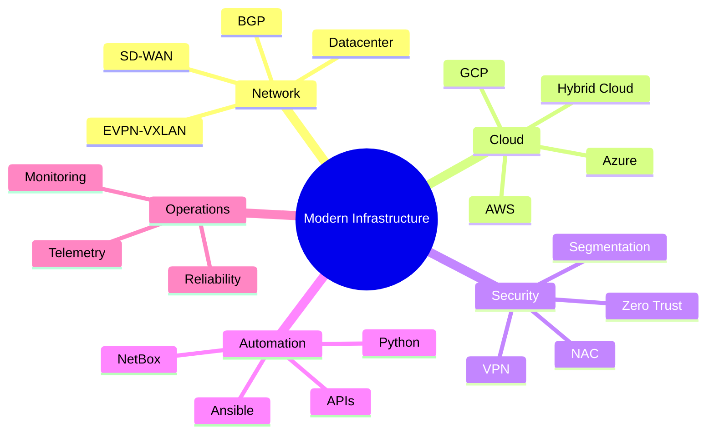

<div align="center">

# NabilNet

### Network · Cloud · Security · Automation

Building secure, resilient, and automated infrastructure for modern enterprises.

[](https://nabilnet.github.io/)
[](#)
[](#)
[](#)

</div>

---

## About

I am a **Senior Network, Cloud, Security, and Automation Engineer** based in Paris, focused on designing modern infrastructure platforms that are secure, scalable, resilient, and automation-ready.

My work combines **enterprise networking**, **multi-cloud architecture**, **Zero Trust security**, **datacenter modernization**, and **NetDevOps automation** to help organizations move from traditional infrastructure to intelligent, cloud-ready operating models.

---

## Core Expertise

```txt
Network Architecture     LAN · WAN · SD-WAN · BGP · OSPF · MPLS · EVPN-VXLAN
Cloud Infrastructure     Azure · AWS · GCP · Hybrid Cloud · Multi-Cloud
Security Engineering     Zero Trust · NAC · VPN · NGFW · Segmentation
Automation & NetDevOps   Ansible · Python · NetBox · Docker · Git · APIs
Datacenter               Cisco Nexus · ACI · Spine-Leaf · F5 · High Availability
Operations               Monitoring · Telemetry · Reliability · Documentation
```

---

## Technology Stack

<p align="center">


</p>

---

## What I Build



---

## Selected Work

### Multi-Cloud Disaster Recovery

Designed a resilient Disaster Recovery architecture across **Azure and AWS**, with automated failover workflows using **Python** and **Ansible**.

`Cloud Resilience` · `Automation` · `Business Continuity` · `Failover Orchestration`

---

### Network Automation Platform

Introduced NetDevOps practices using **Ansible, NetBox, Docker, Git, Python, and REST APIs** to improve operational consistency and reduce manual effort.

`NetDevOps` · `Infrastructure as Code` · `Automation` · `Operational Excellence`

---

### Zero Trust Infrastructure

Supported secure access, segmentation, NAC, VPN, and Zero Trust network patterns across enterprise environments.

`Zero Trust` · `Cisco ISE` · `Zscaler` · `Segmentation` · `Secure Access`

---

### Datacenter Modernization

Designed and supported modern datacenter architectures using **Cisco Nexus, ACI, Spine-Leaf, F5, and EVPN-VXLAN**.

`Datacenter` · `High Availability` · `Scalability` · `Secure Networking`

---

## Experience Snapshot

| Organization | Role | Focus |
|---|---|---|
| OECD | Senior Network & Cloud Engineer | Cloud, Network, Security, Automation |
| ABMC | Network & Cloud Engineer | Azure Gov, SD-WAN, Zscaler, Security |
| eDreams ODIGEO | Network & Cloud Engineer | Multi-Cloud, GCP, Kubernetes |
| OECD | Senior Network & Multimedia Engineer | ACI, ISE, F5, Wireless |
| Subsea 7 | Network & Telecom Engineer | Global Network, MPLS, VSAT, UC |

---

## Professional Focus

```txt
Network Automation
Zero Trust Architecture
Multi-Cloud Networking
Cloud Security
Datacenter Modernization
Infrastructure as Code
AI-driven Operations
Observability & Telemetry
```

---

## Philosophy

> Build infrastructure that is simple to operate, secure by design, resilient by default, and ready to scale.

---

<div align="center">

### Secure. Automated. Resilient. Cloud-ready.

`Network` · `Cloud` · `Security` · `Automation` · `NetDevOps` · `Zero Trust`

<br>

[](https://nabilnet.github.io/)

</div>
