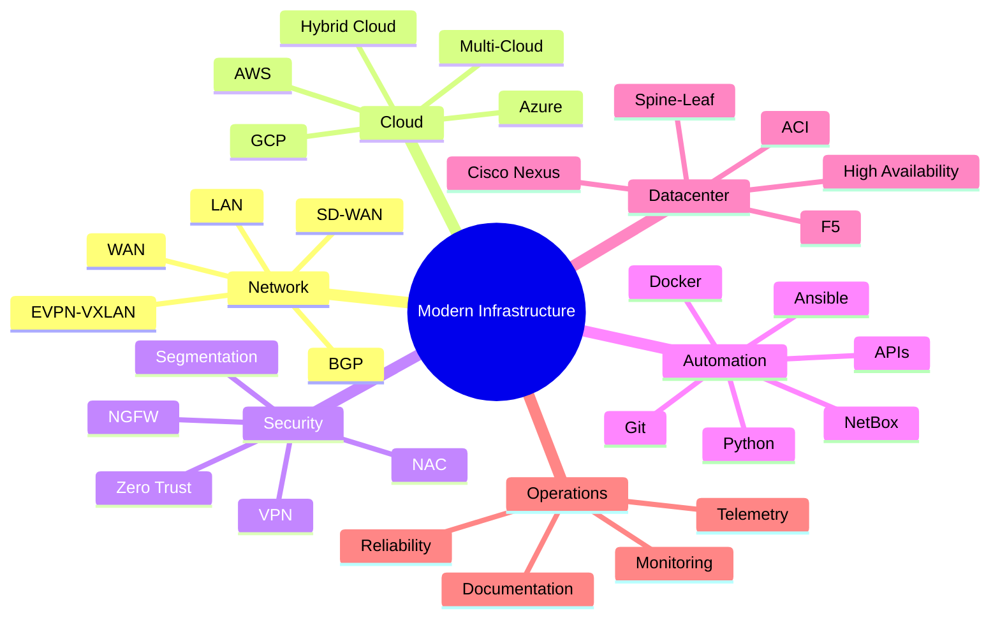

<div align="center">

# NabilNet

### Network • Cloud • Security • Automation Engineer

Building secure, resilient, and automated infrastructure for modern enterprises.

[](https://nabilnet.github.io/)
[](#)
[](#)
[](#)

</div>

---

## About

I am a **Network, Cloud, Security, and Automation Engineer** focused on designing and modernizing enterprise infrastructure across global environments.

My work combines **network architecture**, **cloud connectivity**, **cybersecurity**, **Zero Trust**, **datacenter modernization**, and **NetDevOps automation** to build platforms that are secure, scalable, resilient, and operationally efficient.

I enjoy transforming traditional infrastructure into modern, automated, cloud-ready ecosystems.

---

## Core Focus

```txt
Network Architecture   → LAN, WAN, SD-WAN, BGP, OSPF, MPLS, EVPN-VXLAN
Cloud Infrastructure   → Azure, AWS, GCP, Hybrid Cloud, Multi-Cloud
Security Engineering   → Zero Trust, NAC, VPN, NGFW, Segmentation
Automation             → Ansible, Python, NetBox, Git, Docker, REST APIs
Datacenter             → Cisco Nexus, ACI, Spine-Leaf, F5, High Availability
Operations             → Monitoring, Telemetry, Reliability, Documentation
```

---

## Technology Stack

### Networking


Cisco Nexus • Catalyst • ACI • Juniper • Arista • SD-WAN • BGP • OSPF • MPLS • EVPN-VXLAN • Datacenter Networking

---

### Security


Palo Alto • Fortinet • Check Point • Cisco ISE • F5 BIG-IP • Zscaler • Cloudflare • VPN • NAC • Zero Trust • Network Segmentation

---

### Cloud


Azure • AWS • Google Cloud Platform • Kubernetes • Hybrid Cloud • Multi-Cloud • Cloud Connectivity • Cloud Security

---

### Automation & NetDevOps


Ansible • Python • NetBox • Docker • Git • REST APIs • CI/CD • Infrastructure Automation • Network Automation

---

### Monitoring & Operations


SolarWinds • Splunk • Telemetry • Infrastructure Monitoring • Operational Dashboards • AI-driven Operations

---

## What I Build



---

## Featured Areas

### Network Automation

I design automation workflows that reduce manual operations, improve consistency, and make infrastructure easier to manage.

**Focus areas**

- Network configuration automation
- Inventory-driven automation with NetBox
- Compliance checks
- Automated remediation
- Documentation generation
- Git-based infrastructure workflows

---

### Cloud & Multi-Cloud Connectivity

I work on secure and resilient cloud network architectures across Azure, AWS, and Google Cloud.

**Focus areas**

- Hybrid cloud connectivity
- Multi-cloud network design
- VPN and private connectivity
- Cloud interconnect
- Disaster Recovery architecture
- Secure cloud access

---

### Security & Zero Trust

I contribute to secure infrastructure designs based on identity, segmentation, and least privilege access.

**Focus areas**

- Zero Trust architecture
- Network segmentation
- Secure remote access
- NAC with Cisco ISE
- Zscaler ZIA / ZPA
- Firewall and VPN architecture

---

### Datacenter Modernization

I design and support scalable datacenter architectures for modern enterprise workloads.

**Focus areas**

- Cisco Nexus
- Cisco ACI
- Spine-Leaf architecture
- EVPN-VXLAN
- F5 BIG-IP
- Multi-site resiliency

---

## Selected Projects

### Multi-Cloud Disaster Recovery

Designed a Disaster Recovery architecture across Azure and AWS with automated failover workflows using Python and Ansible.

```txt
Focus: Cloud resilience • Failover orchestration • Business continuity • Automation
```

---

### Network Automation Platform

Introduced NetDevOps practices using Ansible, NetBox, Docker, Git, Python, and REST APIs.

```txt
Focus: Automation • Standardization • Infrastructure as Code • Operational efficiency
```

---

### Secure Zero Trust Infrastructure

Implemented secure access, segmentation, NAC, VPN, and Zero Trust network patterns.

```txt
Focus: Access control • Segmentation • Security architecture • Secure connectivity
```

---

### Datacenter Modernization

Designed and supported modern datacenter infrastructure using Cisco Nexus, ACI, spine-leaf, and EVPN-VXLAN.

```txt
Focus: Scalability • Resilience • High availability • Secure datacenter networking
```

---

## Experience Snapshot

| Organization | Role | Focus |
|---|---|---|
| OECD | Senior Network & Cloud Engineer | Cloud, Network, Security, Automation, Datacenter |
| American Battle Monuments Commission | Network & Cloud Engineer | Azure Government, SD-WAN, Zscaler, Security |
| eDreams ODIGEO | Network & Cloud Engineer | Multi-Cloud, SD-WAN, Kubernetes, GCP |
| OECD | Senior Network & Multimedia Engineer | ACI, ISE, F5, Wireless, Secure Connectivity |
| eDreams ODIGEO | Network & Data Center Engineer | Datacenter, WAN, Security, Cisco Nexus, F5 |
| Sonangol | Network & Data Center Engineer | Campus Network, UC, VPN, Security |
| Gemalto | Network & Data Center Engineer | WAN Migration, ITIL, Change Management |
| Subsea 7 | Network & Telecommunication Engineer | Global Network, MPLS, VSAT, UC, Firewalls |

---

## Certifications & Learning

```txt
Azure Architecture, Infrastructure & Security
Google Cloud Platform Architecture
NetDevOps with Ansible Automation Platform
Network Automation with Python
Cisco ISE — SISE
DevOps with Docker
F5 BIG-IP LTM
Cisco ASA Firewall Solutions
Cisco Unified Communications
```

---

## Current Interests

- Network Automation
- NetDevOps
- Infrastructure as Code
- Zero Trust Architecture
- Multi-Cloud Networking
- Cloud Security
- Datacenter Modernization
- AI-driven Infrastructure Operations
- Observability and Telemetry

---

## GitHub Focus

This GitHub is dedicated to practical infrastructure engineering content:

```txt
Network automation scripts
Ansible playbooks
Python tools for network operations
NetBox integrations
Cloud networking labs
Security automation workflows
Infrastructure documentation templates
Architecture notes and diagrams
```

---

## Design Philosophy

> Simple systems are easier to secure.  
> Automated systems are easier to scale.  
> Well-documented systems are easier to operate.

I believe modern infrastructure should be clean, secure, observable, automated, and designed with operational simplicity in mind.

---

## Connect

<div align="center">

[](https://nabilnet.github.io/)
[](#)
[](#)
[](#)

</div>

---

<div align="center">

### Building secure, resilient, automated, and cloud-ready infrastructure.

`Network` · `Cloud` · `Security` · `Automation` · `NetDevOps` · `Zero Trust` · `Multi-Cloud`

</div>
